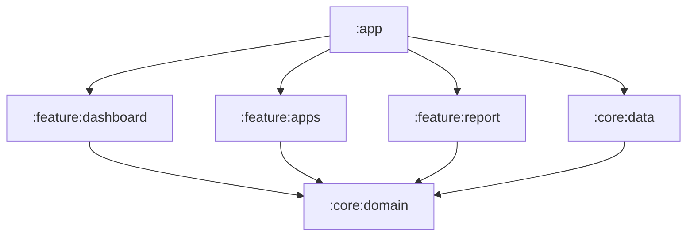

# Battery Thermal Profiler

An Android app that profiles battery and thermal behavior over time, estimates per-app drain, and generates shareable reports.

## Modules

- `:app` — entry point, navigation
- `:core:data` — Room, DataStore, repository implementations
- `:core:domain` — models + use cases (pure Kotlin)
- `:feature:dashboard` — live stats screen
- `:feature:apps` — per-app breakdown
- `:feature:report` — report generation

## Architecture

## Diagram placeholder

TODO: replace with a detailed architecture diagram + data flow.

