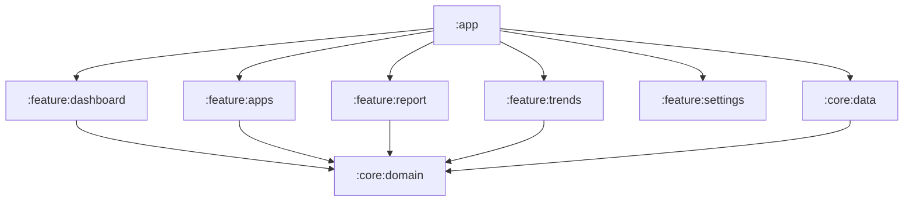

# Battery & Thermal Profiler

An Android app that profiles battery and thermal behavior over time, estimates per-app drain, and generates shareable reports.

## Modules

- `:app` — entry point, navigation
- `:core:data` — Room, DataStore, repository implementations
- `:core:domain` — models + use cases (pure Kotlin)
- `:feature:dashboard` — live stats screen
- `:feature:apps` — per-app breakdown
- `:feature:report` — report generation
- `:feature:trends` — historical charts
- `:feature:settings` — configuration (collection interval, retention, etc.)

## Setup

- **Requirements**: Android Studio (or Gradle), Android SDK Platform 36 (compileSdk), target SDK 35, min SDK 26.
- **Build**:

```bash
./gradlew :app:assembleDebug
```

## Permissions (why they’re needed)

- **Usage access** (`PACKAGE_USAGE_STATS`): needed to attribute screen-time / foreground usage and estimate per-app drain. Grant it via **Settings → Usage access**.
- **Boot completed** (`RECEIVE_BOOT_COMPLETED`): used to restart monitoring after reboot (only if enabled in Settings).
- **Foreground service** (`FOREGROUND_SERVICE`, `FOREGROUND_SERVICE_DATA_SYNC`): used for continuous monitoring on supported OS versions.

## Architecture



## Known limitations

- **OEM variability**: thermal sensors, `/sys` files, and battery current APIs vary across devices.
- **Foreground service restrictions**: newer Android versions may block background-initiated foreground service starts; the app avoids crashing, but continuous monitoring may be limited.

## TODO

- Add screenshots / demo GIF.
- Replace diagram with a more detailed data-flow chart.

